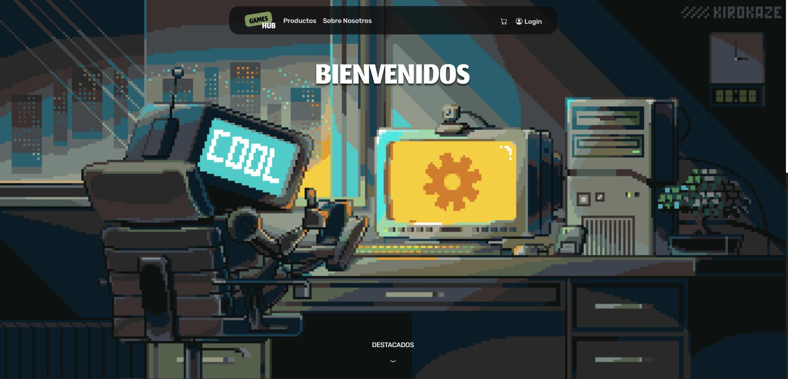

# Trabajo Practico Integrador - Grupo 2

## E-Commerce - GamesHub

### Características:
- **Inicio de Sesión con Roles:** Permite a los usuarios iniciar sesión con diferentes roles, cada uno con permisos específicos para gestionar la aplicación.
-**Gestión de Usuarios:** Los usuarios pueden ser agregados, modificados y eliminados en función de los permisos del rol.
-**Gestión de Productos:** Los productos pueden ser agregados, modificados y eliminados.
-**Búsqueda y Filtrado de Productos:** Incluye un sistema de búsqueda y filtrado para encontrar productos rápidamente.
-**Interfaz de Usuario Intuitiva:** Diseñado con una interfaz clara y fácil de usar utilizando React y CSS.

### Tecnologías:

- **Frontend:**
    - 
    - 

- **Backend:**
    - : Utiliza `https://drive.google.com/drive/folders/1tMT3o_oQ3EcVfD0sKb_QFyNL9HoP4Cg-?usp=sharing` para simular las operaciones de backend y la gestión de datos

## Integrantes:
    - BRIZIO, Mauro
    - CARANTA, Mateo
    - CURA, Valentin
    - D'ANUNZIO, Matias
